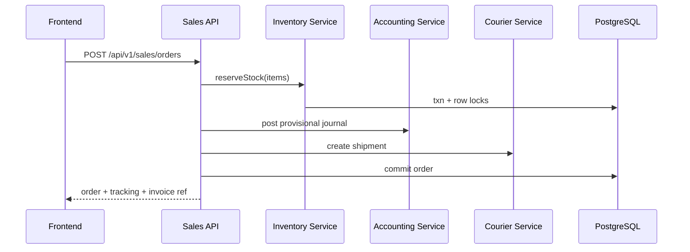

# Phase 1 — System Architecture

## 1) Folder Structure

```text
backend/src
├── api/v1
│   ├── controllers/      # Transport orchestration only
│   ├── routes/           # Versioned route trees
│   ├── services/         # Application services/use-cases
│   └── validators/       # Joi/Zod request schemas
├── modules/
│   ├── auth/
│   ├── inventory/
│   ├── sales/
│   ├── purchases/
│   ├── accounting/
│   ├── courier/
│   └── reports/
├── db/
│   ├── schema.sql
│   └── pool.js
├── middlewares/
├── config/
└── utils/

frontend/src
├── app/                  # Router, providers, auth bootstrap
├── components/           # Shared UI primitives
├── features/
│   ├── inventory/
│   ├── sales/
│   ├── purchases/
│   ├── accounting/
│   ├── courier/
│   ├── reports/
│   └── dashboard/
├── services/             # API clients + interceptors
├── hooks/
└── utils/
```

## 2) Component + API Organization

- **Feature-first frontend**: Each feature owns pages, forms, table config, and domain hooks.
- **Backend layering**: `route -> validator -> controller -> service -> repository(db)`.
- **Cross-cutting modules**: `AuditService`, `LedgerPostingService`, `StockService` are reusable to ensure consistency and no duplicate business rules.

## 3) Database relations

- Core entities: `users`, `roles`, `permissions`, `products`, `warehouses`, `stock_balances`.
- Transactions: `sales`, `sale_items`, `purchases`, `purchase_items`, `payments`, `expenses`.
- Finance: `accounts`, `journal_entries`, `journal_lines`, `customer_ledgers`, `supplier_ledgers`.
- Logistics: `courier_shipments`, `cod_settlements`.
- Integrity enforced through strict FK + check constraints + unique composite keys.

## 4) API Versioning

- Prefix all routes with `/api/v1`.
- Non-breaking changes: additive fields only.
- Breaking changes: new namespace `/api/v2` while maintaining older controllers until migration window closes.

## 5) Security Layers

1. **JWT access token** (short TTL) + refresh token rotation.
2. **Role + permission guard** with granular actions (`inventory.adjust`, `sales.refund`, `accounting.close_month`).
3. **Input validation** (Joi/Zod), SQL parameterization, and output encoding.
4. **Rate limiting** and brute-force protection on auth endpoints.
5. **Immutable audit logs** for all financial and stock-changing actions.

## 6) Stock Consistency

- Source of truth is append-only `inventory_transactions`.
- `stock_balances` updated in same DB transaction with row lock.
- Outbound stock reservation for pending orders prevents oversell.
- Sale confirmation consumes reserved stock; cancellation releases reservation.

## 7) Concurrency & Race Conditions

- Use `SELECT ... FOR UPDATE` on `stock_balances` and account totals.
- Wrap sale/purchase posting + ledger entries in a single DB transaction.
- Add idempotency keys for payment webhook and courier callbacks.
- Use optimistic lock (`version` column) for sensitive edits (e.g., manual stock adjustments).

---

## High-level flow (sale with COD)


